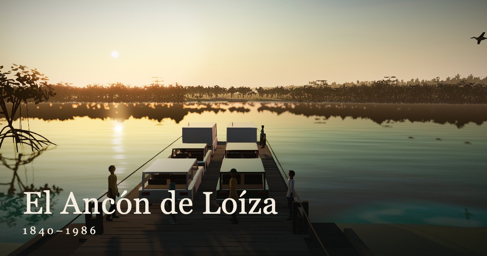

# El Ancón de Loíza

A cinematic, historically accurate 3D reconstruction of the **Ancón de Loíza** — the hand-powered river ferry that crossed the Río Grande de Loíza, Puerto Rico, from the 1820s until the PR-187 bridge ("Puente de la Restauración") replaced it in 1985–86. In Spanish and English.

**Live:** https://gabriel-rene.github.io/ancon-de-loiza/

## What you can do

- **Pick an era** on the timeline, 1840 to 1986: the ferry, the crew, the landings, the town, the plants, the animals and the traffic change with it.
- **Three views:** Ride (on the deck), Shore (standing on the Loíza landing) and Sky. Drag to look around; the view stays where you leave it; Recenter brings it back.
- **Facts:** 3–5 sourced facts per era, each with its source links. Inferred items are labelled.
- **Sound** (off by default) and **Quality** (Auto, High, Medium, Low).

### Keyboard

| Key | Does |
|---|---|
| Tab | Moves through the controls; the first stop skips to the timeline |
| ← → | Previous / next era (when the scene does not have focus) |
| ← → ↑ ↓ on the scene | Look around |
| + − on the scene | Zoom |
| 1 · 2 · 3 | Ride · Shore · Sky |
| R | Recenter |
| Esc | Closes Facts or the Quality menu |

### Accessibility

Every control works by keyboard and has a spoken name; era changes are announced. With *reduce motion* set in the system, era changes and camera moves are instant (the ferry and the river keep moving: they are the subject). Text over the scene meets WCAG AA contrast. Without WebGL the page still shows the facts for every era.

## Research

All scene details come from a sourced dossier: [`docs/research/ancon-research.md`](docs/research/ancon-research.md). Every claim has a citation and a confidence level. Inferred details are labelled as such, in the docs and in the app.

## Design

[`docs/superpowers/specs/2026-09-26-ancon-loiza-design.md`](docs/superpowers/specs/2026-09-26-ancon-loiza-design.md), with one spec per phase in [`docs/superpowers/specs/`](docs/superpowers/specs/) and the rulings for each phase in [`docs/superpowers/notes/`](docs/superpowers/notes/).

## Roadmap

- [x] Phase 0 — Repo, research, design, plan
- [x] Phase 1 — Terrain, river, sky, light, water
- [x] Phase 2 — Vegetation: mangroves, palms, casuarinas, buttonwood, sea grape, almendros, ground cover, cane and era landscapes
- [x] Phase 3 — The ancón per era: crossing loop, crew, era picker; 3b: sourced facts panel
- [x] Phase 4 — The landings, the town, the ferry's load and the 1986 bridge traffic
- [x] Phase 5 — Birds and water life
- [x] Phase 6 — True-scale timeline, era fade, three views (6a); sound (6b)
- [x] Phase 7 — Phones and speed (7a); accessibility and launch (7b)

Open items (fact checks, art notes) are listed in the rulings notes of each phase.

## Development

`npm run dev` · `npm test` · `npm run build` · `npm run e2e` (Playwright on the production build; the GPU leak probe is tagged `@slow`, and `npm run e2e:fast` skips it with `--grep-invert @slow`).

Launch images are made by hand and committed: `node scripts/make-icons.ts` (favicon PNGs from `public/favicon.svg`) and `node scripts/make-share-card.ts` (with `npm run preview` running).

## Stack

Vite · React · TypeScript · React Three Fiber · drei · postprocessing · zustand. All 3D models and sound are made in code. Deployed to GitHub Pages.

## Acknowledgements

The Cortijo family, the Colectivo El Ancón de Loíza, and the Archivo Negro collection *El Ancón de Loíza: Un Vínculo Histórico*, whose photographs and testimony make this reconstruction possible.

Map data © OpenStreetMap contributors (ODbL). The derived geography bundle `src/data/geo/loiza.json` is licensed under ODbL 1.0 — see [`src/data/geo/README.md`](src/data/geo/README.md); the rest of the repository is MIT ([LICENSE](LICENSE)).
